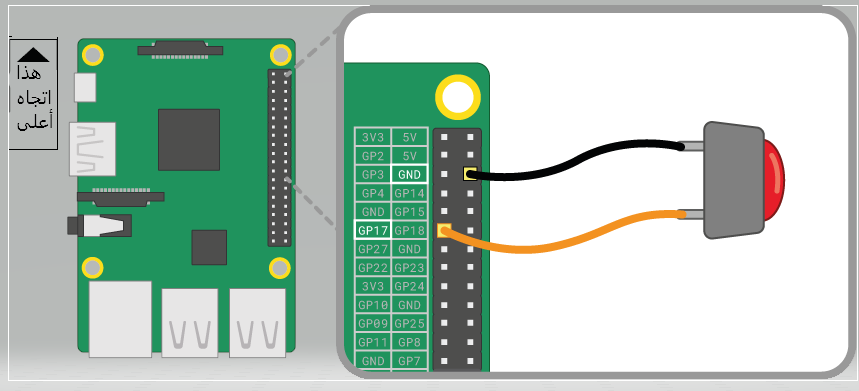

الرز هو احد ابسط مهام الادخال التي يمكنك توصيلها بجهاز Raspberry Pi. إنه مكون غير مستقطب، مما يعني أنه يمكنك وضعه في الدائرة الكهربائية بأي طريقة في كانت وسيعمل.

هناك أنواع مختلفة من الأزرار - يمكن أن يكون لها على سبيل المثال ساقين أو أربعة. ممكن أستخدام الإصدار ذو الساقين في الغالب مع الأسلاك للأتصال بجهاز التحكم. يتم تثبيت الأزرار ذات الأربعة سيقان بشكل عام على لوحة الدوائر المطبوعة أو لوحة التوصيل.

توضح الرسوم البيانية أدناه كيفية توصيل زر ذي ساقين أو أربع سيقان بجهاز Raspberry Pi. في كلتا الحالتين، ** GPIO 17 ** هو نقطة الإدخال.

 

إذا كنت تستخدم أزرارًا متعددة، فمن الأفضل غالبًا استخدام * أرضية مشتركة * لتجنب توصيل عدد كبير جدًا من وصلات المرور إلى ** GND ** النقطة المعنية. يمكنك توصيل السكة السالبة على لوحة التوصيل بأرضية * واحدة * الى النقطة، والذي يسمح لجميع الأزرار باستخدام نفس السكة الأرضية.

