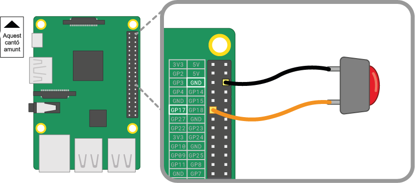
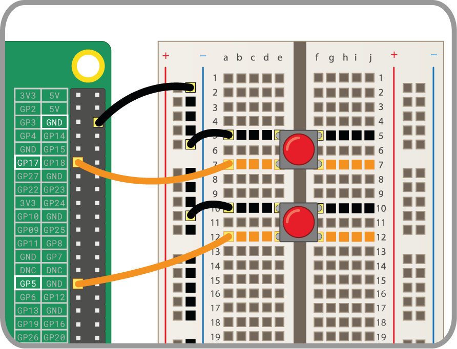

Un interruptor és un dels components d’entrada més senzills que pots connectar a una Raspberry Pi. És un component no polaritzat, cosa que vol dir que el pots col·locar en un circuit de qualsevol manera i funcionarà.

Hi ha diversos tipus d'interruptors; per exemple, poden tenir dues o quatre potes. Les versions de dues potes s'utilitzen principalment amb cable a l'aire per connectar-se al dispositiu de control. Els interruptors de quatre potes generalment es munten sobre un PCB o una placa de proves.

Els gràfics que es mostren a continuació mostren com connectar un interrptor de dues potes o de quatre potes a una Raspberry Pi. En ambdós casos, **GPIO 17** és el pin d’entrada.

 

Si fas servir diversos interruptors, és millor utilitzar un *terra comú* per evitar la connexió de masses cables pont a pins de terra **GND**. Pots connectar la filera negativa de la placa de proves a un únic pin *terra*, que permeti que tots els interruptors utilitzin la mateixa filera terra.

