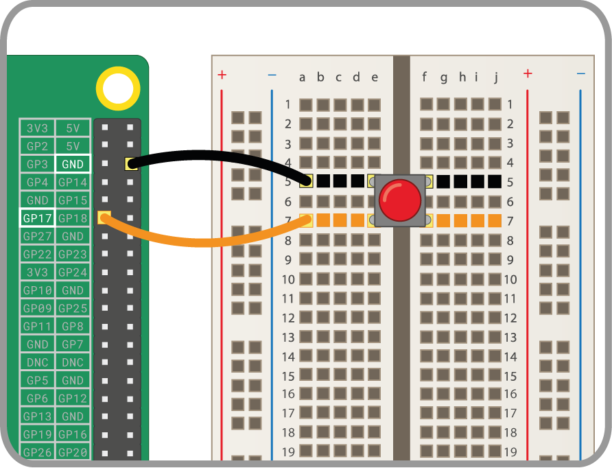

Ein Taster ist eine der einfachsten Eingabekomponenten, die du mit einem Raspberry Pi verbinden kannst. Es ist eine nicht polarisierte Komponente, was bedeutet, dass du die Anschlüsse beliebig vertauschen kannst und sie funktioniert trotzdem.

Es gibt verschiedene Arten von Tastern - sie können beispielsweise zwei oder vier Anschlüsse haben. Die zweibeinigen Versionen werden meistens mit fliegenden Drähten mit dem Steuergerät verbunden. Taster mit vier Beinen sind in der Regel auf einer Leiterplatte oder einem Steckbrett montiert.

Die folgenden Abbildungen zeigen, wie du einen Taster mit zwei oder vier Anschlüssen mit einem Raspberry Pi verbindest. In beiden Fällen ist **GPIO 17** der Eingangspin.

 

Wenn du mehrere Taster verwendest, ist es häufig am besten, eine * gemeinsame Masse * zu verwenden um zu vermeiden, dass zu viele Kabel an den ** GND/Masse **-Pins angeschlossen werden. Du kannst die negative Schiene auf dem Steckbrett mit einem einzigen * Massestift * verbinden, und für alle Tasten dieselbe Masse-Schiene verwenden.

