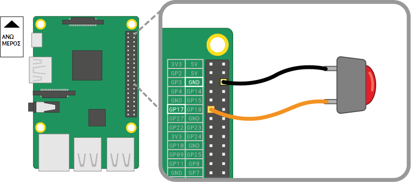
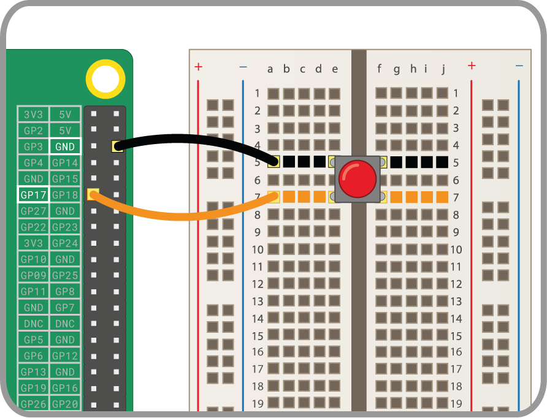

Ένα κουμπί είναι ένα από τα απλούστερα στοιχεία εισόδου που μπορείς να συνδέσεις σε ένα Raspberry Pi. Είναι ένα εξάρτημα χωρίς πολικότητα, που σημαίνει ότι μπορείς να το τοποθετήσεις σε ένα κύκλωμα από οποιαδήποτε πλευρά και θα λειτουργήσει.

Υπάρχουν διάφοροι τύποι κουμπιών - μπορούν για παράδειγμα να έχουν δύο ή τέσσερις ακροδέκτες. Οι εκδόσεις δύο ακροδεκτών χρησιμοποιούνται ως επί το πλείστον με σύρμα στον αέρα για σύνδεση με τη συσκευή ελέγχου. Τα κουμπιά με τέσσερις ακροδέκτες γενικά τοποθετούνται σε ένα τυπωμένο κύκλωμα ή ένα ράστερ.

Τα παρακάτω διαγράμματα δείχνουν τον τρόπο σύνδεσης ενός κουμπιού με δύο ή τέσσερις ακροδέκτες σε ένα Raspberry Pi. Και στις δύο περιπτώσεις, **GPIO 17** είναι ο ακροδέκτης εισόδου.

 

Εάν χρησιμοποιείτε πολλαπλά κουμπιά, τότε είναι συχνά καλύτερο να χρησιμοποιήσετε ένα σημείο *κοινής γείωσης* για να αποφύγετε τη σύνδεση πάρα πολλών αγωγών διασύνδεσης στις ακίδες **GND**. Μπορείτε να καλωδιώσετε την αρνητική γραμμή στο ράστερ σε μία μόνο ακίδα *γείωσης*, η οποία επιτρέπει σε όλα τα κουμπιά να χρησιμοποιούν την ίδια γείωση.

