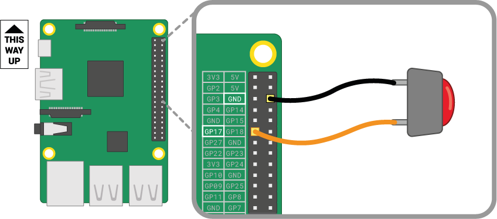

A button is one of the simplest input components you can wire to a Raspberry Pi. It's a non-polarised component, which means you can place it in a circuit either way round and it will work.

There are various types of buttons - they can for example have two or four legs. The two-leg versions are mostly used with flying wire to connect to the control device. Buttons with four legs are generally mounted on a PCB or a breadboard.

The diagrams below shows how to wire a two-leg or four-leg button to a Raspberry Pi. In both cases, **GPIO 17** is the input pin.

If you are using multiple buttons, then it is often best to use a *common ground* to avoid connecting too many jumper leads to **GND** pins. You can wire the negative rail on the breadboard to a single *ground* pin, which allows all the buttons to use the same ground rail.

