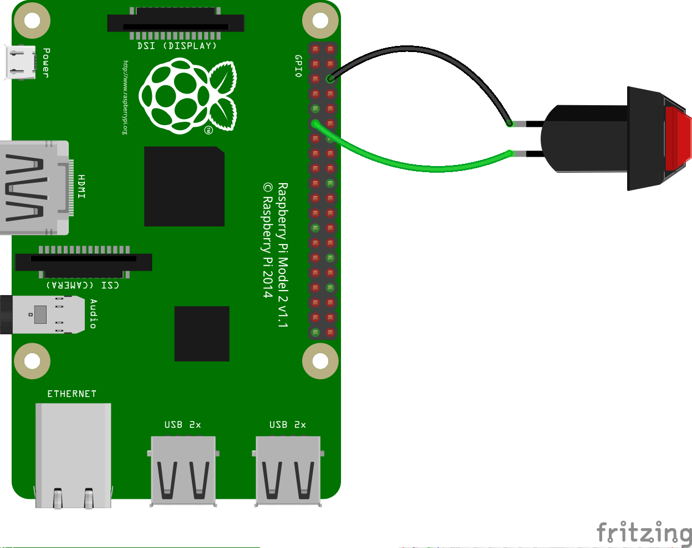
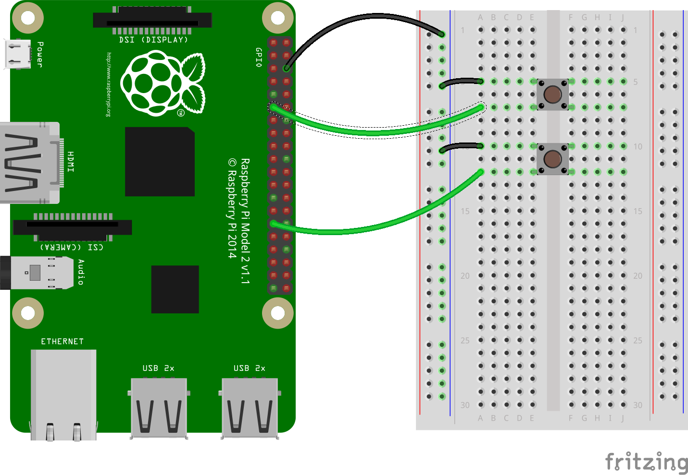

### Wiring a single button

A button is more or less the simplest of the input components you can wire to a Raspberry Pi.
A button is a non-polarised component. This means you can place it in a circuit either way round, and it will still work.

There are various types of button that you can use. Some have two legs and others have four legs. The two leg versions are usually designed to be used in with flying wires, that connect to the control device.

Buttons with four legs are usually mounted on a PCB or a breadboard.

Look at the diagrams below to see how you can wire a button to a Raspberry Pi. In both cases GPIO pin 17 is being used as the input pin.

If you are using multiple buttons, then it is often better to use a *common ground*. This prevents too many jumper leads being connected to **GND** pins on the Raspberry Pi. You can wire the negative rail on the breadboard to a single *ground* pin and then all the buttons can use the same ground rail.

