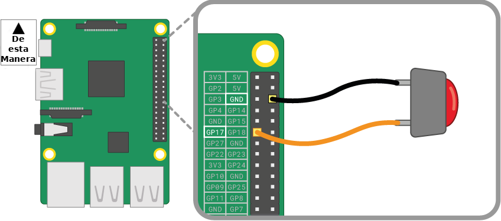

Un botón es uno de los componentes de entrada más simples que puedes conectar a una Raspberry Pi. Es un componente no polarizado, lo que significa que puedes colocarlo en un circuito de cualquier manera y funcionará.

Existen varios tipos de botones: pueden tener, por ejemplo, dos o cuatro patillas. Las versiones de dos patillas se utilizan principalmente con cable de puente para conectarse al dispositivo de control. Los botones con cuatro patillas generalmente se montan en una placa PCB o una placa de pruebas.

Los siguientes diagramas muestran cómo conectar un botón de dos o cuatro patillas a una Raspberry Pi. En ambos casos, **GPIO 17** es el pin de entrada.

 

Si estás utilizando múltiples botones, entonces a menudo es mejor usar una *tierra común* para evitar conectar demasiados cables de puente a las patillas **GND**. Puedes conectar el riel negativo en la placa de pruebas a un solo pin de *tierra*, esto permite que todos los botones utilicen el mismo riel de tierra común.

