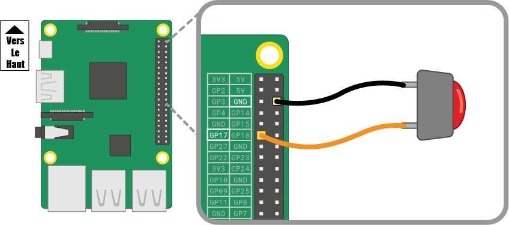

Un bouton est l'un des composants d'entrée les plus simples que tu peux relier à un Raspberry Pi. C'est un composant non polarisé, ce qui signifie que tu peux le placer dans un circuit dans les deux sens et cela fonctionnera.

Il existe différents types de boutons - ils peuvent par exemple avoir deux ou quatre pieds. Les versions à deux pieds sont principalement utilisées avec du fil volant pour se connecter au dispositif de commande. Les boutons à quatre pieds sont généralement montés sur un PCB ou une platine d'expérimentation.

Les schémas ci-dessous montrent comment câbler un bouton à deux ou quatre pieds à un Raspberry Pi. Dans les deux cas, **GPIO 17** est la broche d'entrée.

 

Si tu utilises plusieurs boutons, il est souvent préférable d'utiliser une *masse commune* pour éviter de connecter trop de fils de cavalier aux broches **GND**. Tu peux câbler le rail négatif de la platine d'expérimentation à une seule broche *masse*, qui permet à tous les boutons d'utiliser le même rail de masse.

