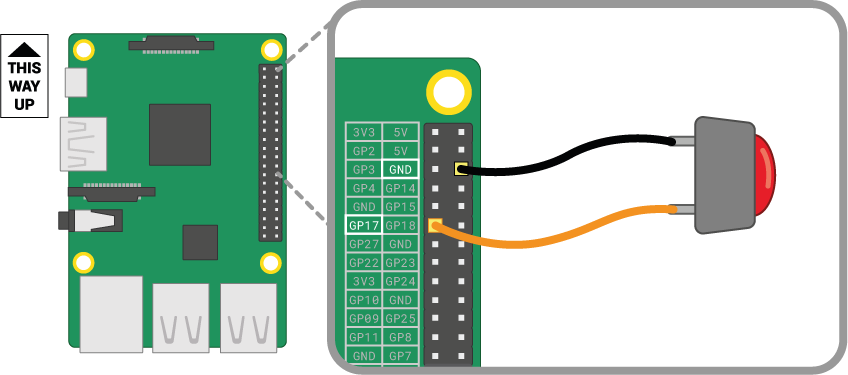

एक बटन सबसे आसान इनपुट किये जाने वाले पुर्ज़ो में से एक है जिसे आप Raspberry Pi को वायर (wire) के साथ जोड़ सकते हैं। यह एक "नॉन-पोलराइज्ड" (non-polarised) पुर्ज़ा है, जिसका अर्थ है कि आप इसे किसी भी तरह से सर्किट (circuit) में जोड़ सकते हैं और यह काम करेगा।

विभिन्न प्रकार के बटन होते हैं - उदाहरण के लिए दो या चार पैर के बटन भी हैं। दो-पैर वाले बटनों का उपयोग ज्यादातर नियंत्रण डिवाइस (control device) से कनेक्ट करने के लिए फ्लाइंग वायर (flying wire) के साथ इस्तमाल किया जाता है। चार पैरों वाले बटन आमतौर पर पीसीबी (PCB) या ब्रेडबोर्ड (breadboard) पर लगाए जाते हैं।

नीचे दिए गए चित्र से पता चलता है कि एक Raspberry Pi को दो-पैर या चार-पैर के बटन के साथ कैसे जोड़ते है। दोनों ही मामलों में, **GPIO 17** इनपुट पिन है |

 

यदि आप कई बटनों का उपयोग कर रहे हैं, तो बहुत सारे जम्पर लीडस् (jumper leads) को **GND** पिन से जोड़ने से बचने के लिए अक्सर एक *common ground* का उपयोग करना सबसे अच्छा है। आप ब्रेडबोर्ड (breadboard) पर नेगेटिव रेल (negative rail) को एक *ground* पिन और वायर के साथ जोड़ सकते हैं, जो सभी बटनों को एक ही ग्राउंड रेल (ground rail) का उपयोग करने की अनुमति देता है।

