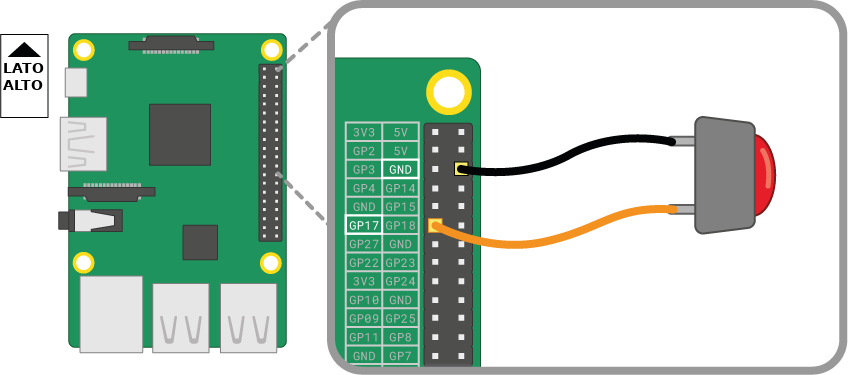

Un pulsante è uno dei componenti di input più semplici che si possono collegare a un Raspberry Pi. È un componente non polarizzato, il che significa che puoi posizionarlo in un circuito in entrambi i sensi e funzionerà.

Esistono vari tipi di pulsanti, ad esempio possono avere due o quattro piedini. Le versioni a due piedini sono utilizzate principalmente con fili volanti per il collegamento al dispositivo di controllo. I pulsanti con quattro piedini sono generalmente montati su un PCB o una breadboard.

Gli schemi seguenti mostrano come collegare un pulsante a due o quattro piedini a un Raspberry Pi. In entrambi i casi, **GPIO 17** è il pin di input.

 

Se si utilizzano più pulsanti, è spesso preferibile utilizzare una *terra comune* per evitare il collegamento di troppi jumper sui pin **GND**. È possibile collegare la pista (rail) negativa sulla breadboard a un singolo pin *terra*, in modo che tutti i pulsanti utilizzino la stessa pista.

