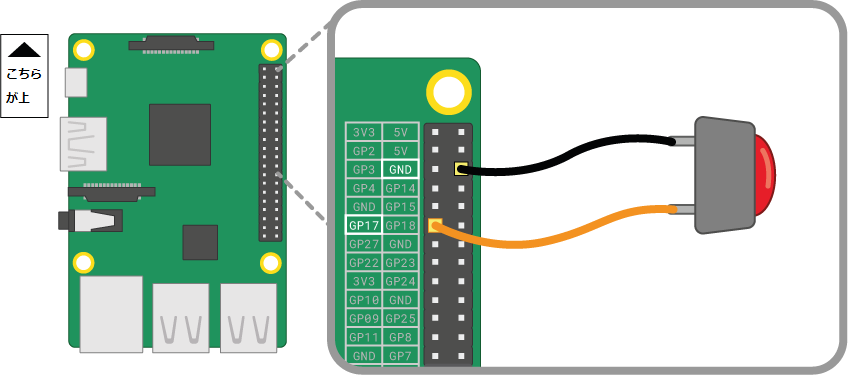

押しボタンスイッチは、Raspberry Piに接続できる最も単純な入力用の部品の1つです。 極性がない部品なので、回路内でどちら向きに接続しても正常に動きます。

押しボタンスイッチにはさまざまなタイプがあります。2本ピンタイプや4本ピンタイプなどです。 2本ピンタイプは、制御装置にほとんどの場合ケーブルで配線されます。 4本ピンタイプは、通常、PCBまたはブレッドボードに取り付けられます。

下の図は、2本ピンタイプ、4本ピンタイプの押しボタンスイッチをRaspberry Piに配線する方法を示しています。 どちらの場合も、**GPIO 17**は入力ピンです。

 

複数の押しボタンスイッチを使用する場合、*GND*ピンへのジャンパーリードの接続が多くなりすぎないように、**共通グラウンド**を使用するのがベストでしょう 。 ブレッドボードのマイナスラインを1つの*グラウンド*ピンに配線します。そうすればすべての押しボタンスイッチで同じグランドラインを使用できます。

