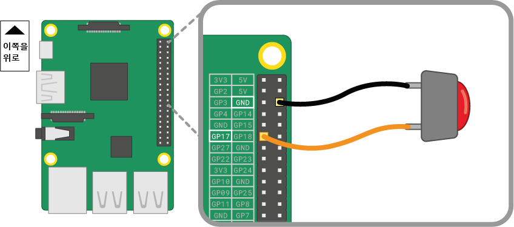

버튼은 Raspberry Pi에 연결할 수 있는 가장 간단한 입력 부품 중 하나입니다. 극성이 없는 부품이므로 회로의 방향과 상관없이 배치해도 잘 작동합니다.

버튼은 종류가 다양합니다 - 예를 들어 2개나 4개의 핀이 있을 수 있습니다. 핀이 2개인 버튼은 대부분 제어 장치에 연결하기 위해 플라잉 와이어와 함께 사용됩니다. 핀이 4개인 버튼은 일반적으로 PCB 기판 또는 브레드보드에 장착됩니다.

아래 그림은 2개나 4개의 핀을 가진 버튼을 Raspberry Pi에 연결하는 방법을 보여줍니다. 두 경우 모두, **GPIO 17**이 입력 핀입니다.

 

여러 개의 버튼을 사용하는 경우, 너무 많은 점퍼 케이블을 **GND**에 연결하지 않도록 *공통 접지*를 사용하는 것이 가장 좋습니다. 브레드보드에 있는 -극 레일을 *그라운드* 핀으로 연결하여, 버튼이 동일한 그라운드 레일을 공유하게 할 수 있습니다.

