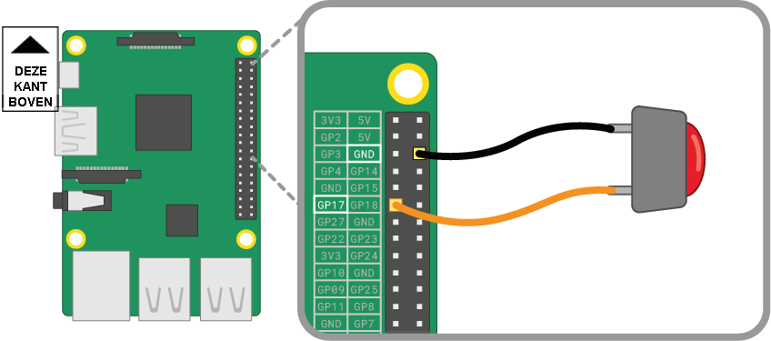

Een drukknop is een van de eenvoudigste invoercomponenten die je op een Raspberry Pi kunt aansluiten. Het is een niet-gepolariseerde component, wat betekent dat je het willekeurig in een circuit kunt plaatsen en zal werken.

Er zijn verschillende soorten drukknoppen - ze kunnen bijvoorbeeld twee of vier poten hebben. De versies met twee poten worden meestal gebruikt met losse draden om verbinding te maken met het besturingsapparaat. Drukknoppen met vier poten worden meestal op een printplaat of een experimenteerbord gemonteerd.

De onderstaande schema's laten zien hoe je een drukknop met twee of vier poten op een Raspberry Pi aansluit. In beide gevallen is **GPIO 17** de invoerpin.

 

Als je meerdere knoppen gebruikt, is het vaak het beste om een *gemeenschappelijke aarde (nul)* te gebruiken om te voorkomen dat er teveel verbindingsdraden worden aangesloten op de **GND** pinnen. Je kunt de blauwe negatieve (-) lijn op het experimenteerbord op één enkele *nul* pin aansluiten, waardoor alle knoppen van dezelfde nul gebruik kunnen maken.

