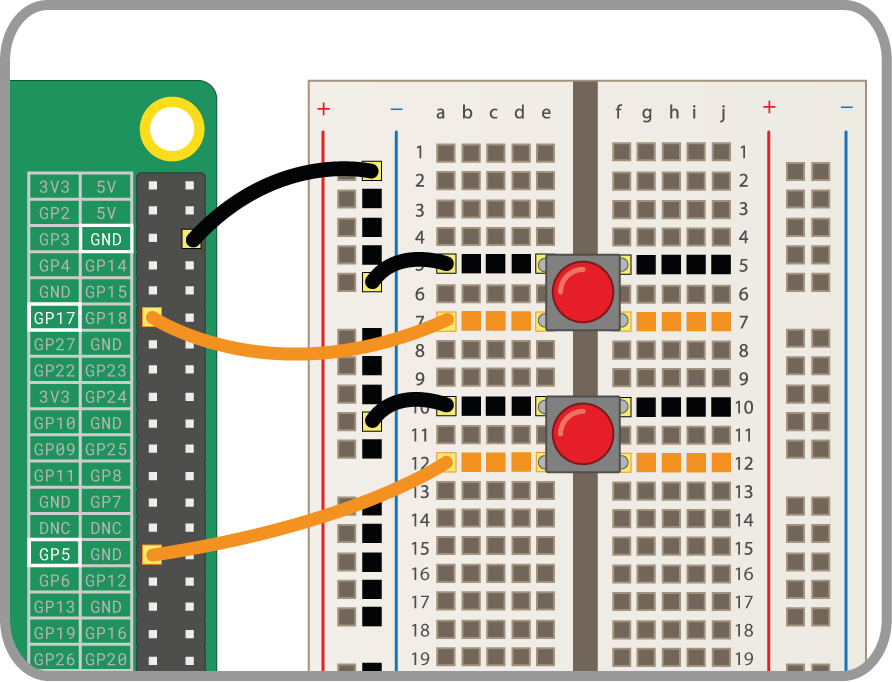

Przycisk jest jednym z najprostszych elementów wejściowych, które możesz podłączyć do Raspberry Pi. Jest to element niespolaryzowany, co oznacza że możesz go umieścić w dowolnym miejscu obwodu i zadziała.

Istnieją różne rodzaje przycisków - mogą na przykład mieć dwie lub cztery nogi. Wersje dwunożne są najczęściej używane z przewodem do połączenia z urządzeniem sterującym. Przyciski z czterema nogami są zazwyczaj montowane na płytce drukowanej(PCB) lub płycie stykowej.

Poniższe diagramy pokazują, jak podłączyć dwunożny lub czteronożny przycisk do Raspberry Pi. W obu przypadkach **GPIO 17** jest pinem wejściowym.

 

Jeśli używasz wielu przycisków, często najlepiej jest użyć *wspólnego uziemienia* aby uniknąć podłączenia zbyt dużej liczby zworek do pinu **GND**. Możesz połączyć szynę ujemną na płytce stykowej z pojedynczym pinem *uziemienia*, który pozwala wszystkim przyciskom korzystać z tej samej szyny uziemiającej.

