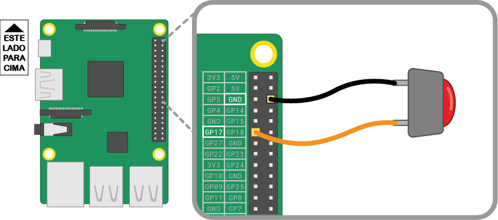

Um botão é um dos componentes de entrada mais simples que você pode conectar a um Raspberry Pi. É um componente não polarizado, o que significa que você pode colocá-lo em um circuito de forma inversa e ele funcionará.

Existem vários tipos de botões - eles podem, por exemplo, ter duas ou quatro pernas. As versões de duas pernas são usadas principalmente com fio solto para conectar ao dispositivo de controle. Botões com quatro pernas geralmente são montados em uma placa de circuito impresso ou em uma protoboard.

Os diagramas abaixo mostram como conectar um botão de duas ou quatro pernas a um Raspberry Pi. Em ambos os casos, **GPIO 17** é o pino de entrada.

 

Se você estiver usando vários botões, geralmente é melhor usar um *terra comum* para evitar conectar muitos fios de jumper aos pinos **GND**. Você pode conectar o trilho negativo na protoboard a um único pino *terra*, o que permite que todos os botões usem o mesmo trilho de terra.

