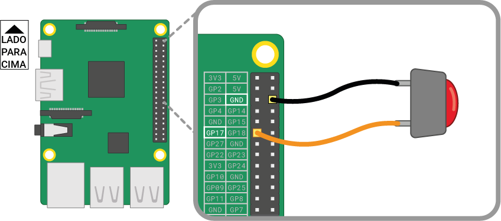

Um botão é um dos componentes de entrada mais simples que tu podes ligar a um Raspberry Pi. É um componente não polarizado, o que significa que podes colocá-lo num circuito de forma inversa e ele funcionará.

Existem vários tipos de botões - eles podem, por exemplo, ter duas ou quatro pernas. As versões de duas pernas são usadas principalmente com fio solto para ligar ao dispositivo de controle. Botões com quatro pernas geralmente são montados numa placa de circuito impresso ou numa placa de ensaio.

Os diagramas em baixo mostram como ligar um botão de duas ou quatro pernas a um Raspberry Pi. Em ambos os casos, o **GPIO 17** é o pino de entrada.

 

Se estiveres a usar vários botões, geralmente é melhor usar um *neutro comum* para evitar ligar muitos fios aos pinos **GND**. Podes ligar o trilho negativo na placa de ensaio a um único pino *neutro*, que permite que todos os botões usem o mesmo trilho neutro.

