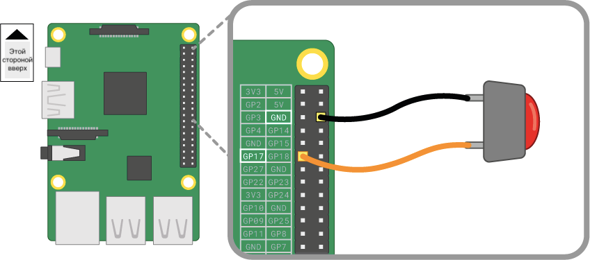

Кнопка - это один из самых простых компонентов ввода, который вы можете подключить к Raspberry Pi. Это неполяризованный компонент, что означает, что вы можете поместить его в цепь в любом направлении, и он будет работать.

Существуют различные типы кнопок – например, они могут иметь две или четыре ножки. Версии с двумя ножками в основном используются с проводом для подключения к контрольному устройству. Кнопки с четырьмя ножками обычно устанавливаются на печатной плате или макетной плате.

На диаграммах ниже показано, как подключить кнопку с двумя или четырьмя ножками к Raspberry Pi. В обоих случаях пин **GPIO 17** является входным контактом.

 

Если вы используете несколько кнопок, то часто лучше использовать *общую землю*, чтобы не подключать слишком много перемычек к контакту **GND**. Вы можете подключить отрицательную шину на макетной плате к одному контакту *земли*, и это позволит всем кнопкам использовать одну и ту же шину заземления.

