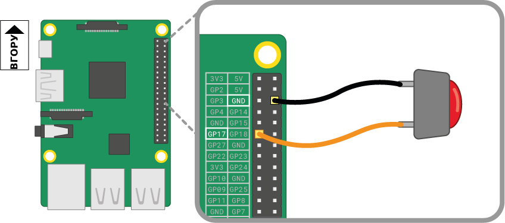

Кнопка — один з найпростіших компонентів вводу, які ти можеш приєднати до Raspberry Pi. Вона є неполяризованим компонентом, тобто таким, який ти можеш розмістити в електричному колі в будь-якому напрямі, і він працюватиме.

Існують різні типи кнопок, наприклад вони можуть мати дві або чотири ніжки. Версії з двома ніжками в основному використовуються з дротами для з’єднання з контролюючим пристроєм. Кнопки з чотирма ніжками в основному встановлюються на друковані або макетні плати.

Нижченаведені діаграми показують як приєднати кнопку з двома або чотирма ніжками до Raspberry Pi. В обох випадках **GPIO 17** є вхідним піном.

 

Якщо ти використовуєш декілька кнопок, часто краще використовувати *спільне заземлення*, щоб не використовувати занадто багато перемичок, що ведуть до пінів **GND**. Ти можеш приєднати негативну шину на макетній платі до єдиного піна *заземлення*, що дозволяє всім кнопкам викристовувати єдину заземлену шину.

