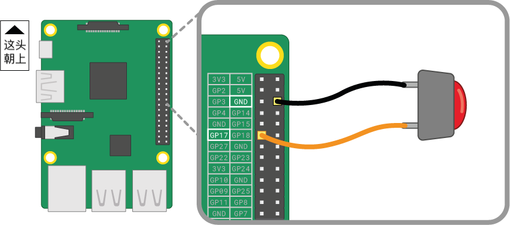

按钮是您可以连接到Raspberry Pi的最简单的输入组件之一。 它是一个非极性元件，这意味着您不必担心以何种方式把它连到电路中。

按钮的类型有很多种 - 它们可能有两个或四个支脚。 两腿版本通常与飞线一起使用以连接到控制设备。 四脚按钮通常安装在 PCB 或面包板上。

下图显示了如何将两脚或四脚按钮连接到Raspberry Pi。 这两种情况下 **GPIO 17** 是输入引脚。

 

如果您使用多个按钮，那么通常最好使用 *公用接地* 以避免将过多的跨接线连接到 **GND** 针脚。 您可以将面包板上的负极连接到单个 *GND* 引脚，它允许所有按钮使用同一列接地插槽。

