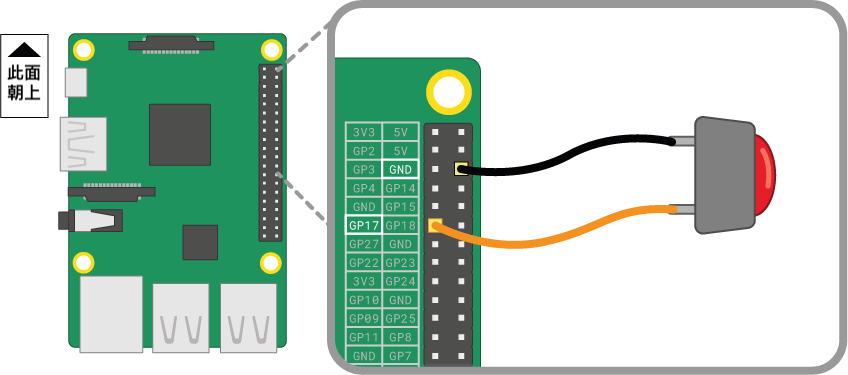

按鈕是讓您可以連接到Raspberry Pi最簡單的輸入元件之一。 由於它不分正負極，因此無論在電路中的連接方向如何，它都可以正常工作。

按鈕有很多種類型-它們可能有兩個或四個支腳。 兩個支腳的版本通常與飛線一起使用以連接到控制設備。 四個支腳的按鈕通常安裝在PCB或麵包板上。

下圖顯示了如何將兩腳或四腳按鈕連接到Raspberry Pi。 在這兩種情況下，** GPIO 17 **是輸入引腳。

 

如果您使用多個按鈕，那麼通常最好使用*公用接地*以避免將過多的跨接線連接到** GND **針腳。 您可以將麵包板上的負電軌連接到單個*接地*引腳，它允許所有按鈕使用同一個接地電軌。

